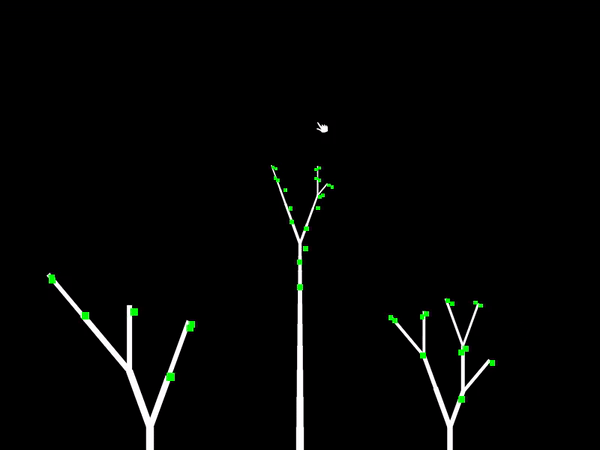
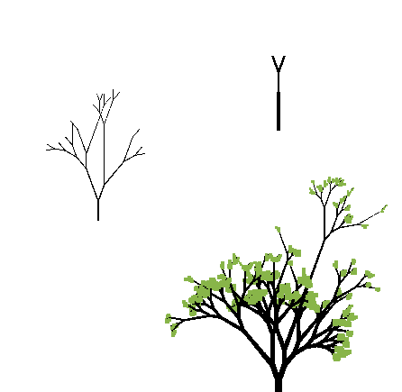

# Algotree

Algorithmicaly generated growing trees

there are currently three versions made with different tools and languages, they vary in functionality and with some code from 2017.

## [Zig](https://ziglang.org/) + [Raylib](https://www.raylib.com/) - 2022
latest version

[source](https://git.sr.ht/~wolfi/algotree-zig)

## Lua + [LÖVE](https://love2d.org/) - 2021
Second version, animated but leaves are not spawining properly

[source](https://git.sr.ht/~wolfi/algotree-love2d)

## [PixiJS](https://pixijs.com/) - 2017
First version, does not animate

[source](https://git.sr.ht/~wolfi/algotree-pixijs)
